```mermaid
flowchart TD
    %% ==================== 1. EINGANG ====================
    A1["E-Mail<br>✅ AUTOMATISIERT"]
    A2["Telefon<br>🔴 MANUELL"]
    A3["Filiale<br>🔴 MANUELL"]
    A4["WhatsApp<br>🔴 MANUELL"]
    A5["Webseite<br>✅ AUTOMATISIERT"]

    A1 --> B
    A2 --> B
    A3 --> B
    A4 --> B
    A5 --> B

    B["Reparaturbedarf<br>angemeldet"]

    %% ==================== 2. PRUEFUNG ====================
    B --> C{"Gewerk richtig?<br>Auftrag annehmen?<br>🔴 MANUELL"}

    C -->|Nein| ENDE1["❌ Ablehnung"]
    C -->|Ja| D["Begutachtungstermin<br>koordinieren<br>🔴 MANUELL<br>Telefon/E-Mail/WhatsApp"]

    %% ==================== 3. BEGUTACHTUNG ====================
    D --> E["Begutachtung<br>vor Ort<br>🔴 MANUELL"]

    E --> F{"Ersatzteil<br>benoetigt?"}

    %% ==================== 4. ERSATZTEIL-PROZESS ====================
    F -->|Ja| G["Vor-Ort-Dokumentation<br>Fotos + Masse<br>🔴 MANUELL<br>🔵 GEPLANT: Telegram"]

    G --> H["Ersatzteil-Recherche<br>Lager? Lieferant?<br>🔴 MANUELL - ZEITAUFWENDIG<br>🔵 GEPLANT: Automatisieren"]

    H --> I["Preis + Lieferzeit<br>ermitteln<br>🔴 MANUELL"]

    I --> J

    %% ==================== 5. AUFTRAGSBESTAETIGUNG ====================
    F -->|Nein| J["Auftragsbestaetigung<br>erstellen<br>🔴 MANUELL<br>🔵 GEPLANT: Auto-generiert"]

    J --> K["Kunde unterschreibt<br>= Rechtliche Beauftragung<br>🔴 MANUELL - BLEIBT SO"]

    K --> L{"Ersatzteil<br>bestellt?"}

    %% ==================== 6. WARTEN ====================
    L -->|Ja| M["Ersatzteil<br>bestellen<br>🔴 MANUELL"]

    M --> N["Warten auf<br>Lieferung"]

    N --> O

    L -->|Nein| O["Reparaturtermin<br>koordinieren<br>🔴 MANUELL<br>🔵 GEPLANT: Voice-Bot"]

    %% ==================== 7. VORBEREITUNG ====================
    O --> P["Terminerinnerung<br>verschicken<br>🟡 FEHLT KOMPLETT<br>🔵 GEPLANT: SMS/E-Mail/Voice"]

    P --> Q["Montageschein<br>erstellen + drucken<br>🔴 MANUELL<br>🔵 GEPLANT: Auto-generiert"]

    %% ==================== 8. DURCHFUEHRUNG ====================
    Q --> R["Reparatur<br>vor Ort<br>🔴 MANUELL - BLEIBT SO"]

    R --> S{"Erfolgreich?<br>>90% Erfolgsquote"}

    S -->|Nein| BREAKOUT["🟠 Breakout-Prozess<br>spaeter definieren"]

    S -->|Ja| T["Montageschein<br>unterschreiben lassen<br>🔴 MANUELL - BLEIBT SO"]

    %% ==================== 9. ABSCHLUSS ====================
    T --> U["Montageschein<br>scannen<br>✅ AUTOMATISIERT<br>Scanner-Webhook → documents"]

    U --> V["Rechnung<br>erstellen<br>🔴 MANUELL im ERP<br>🔵 GEPLANT: Automatisieren"]

    V --> W{"Zahlung<br>eingegangen?"}

    W -->|Nein| X["Zahlungserinnerung<br>/ Mahnung<br>🔴 MANUELL<br>🔵 GEPLANT: Automatisieren"]

    X --> W

    W -->|Ja| Y["Optional:<br>Dankeschoen-E-Mail<br>🔵 GEPLANT"]

    Y --> ENDE2["✅ FERTIG"]

    %% ==================== STYLING ====================
    %% Gruen = Automatisiert
    style A1 fill:#c8e6c9,stroke:#2e7d32
    style A5 fill:#c8e6c9,stroke:#2e7d32
    style U fill:#c8e6c9,stroke:#2e7d32
    style ENDE2 fill:#c8e6c9,stroke:#2e7d32

    %% Rot = Manuell
    style A2 fill:#ffcdd2,stroke:#c62828
    style A3 fill:#ffcdd2,stroke:#c62828
    style A4 fill:#ffcdd2,stroke:#c62828
    style C fill:#ffcdd2,stroke:#c62828
    style D fill:#ffcdd2,stroke:#c62828
    style E fill:#ffcdd2,stroke:#c62828
    style G fill:#ffcdd2,stroke:#c62828
    style H fill:#ef9a9a,stroke:#c62828
    style I fill:#ffcdd2,stroke:#c62828
    style J fill:#ffcdd2,stroke:#c62828
    style K fill:#ffe0b2,stroke:#e65100
    style M fill:#ffcdd2,stroke:#c62828
    style O fill:#ffcdd2,stroke:#c62828
    style Q fill:#ffcdd2,stroke:#c62828
    style R fill:#ffe0b2,stroke:#e65100
    style T fill:#ffe0b2,stroke:#e65100
    style V fill:#ffcdd2,stroke:#c62828
    style X fill:#ffcdd2,stroke:#c62828

    %% Gelb = Fehlt komplett
    style P fill:#fff9c4,stroke:#f9a825

    %% Grau = Ablehnung
    style ENDE1 fill:#e0e0e0,stroke:#616161

    %% Orange = Breakout
    style BREAKOUT fill:#ffe0b2,stroke:#e65100

    %% Blau = Neutrale Entscheidungen
    style B fill:#e3f2fd,stroke:#1565c0
    style F fill:#e3f2fd,stroke:#1565c0
    style L fill:#e3f2fd,stroke:#1565c0
    style N fill:#e3f2fd,stroke:#1565c0
    style S fill:#e3f2fd,stroke:#1565c0
    style W fill:#e3f2fd,stroke:#1565c0
    style Y fill:#e3f2fd,stroke:#1565c0
```

# Reparatur-Workflow Diagramm

> Kopiere den Code in https://mermaid.live
> Stand: 2026-01-26 | Basierend auf 01_SPEC.md v1.0

---

---

## Legende

| Farbe | Symbol | Bedeutung |
|-------|--------|-----------|
| Gruen | ✅ | Bereits automatisiert |
| Rot | 🔴 | Aktuell manuell |
| Dunkelrot | 🔴 | Manuell + Schmerzpunkt |
| Gelb | 🟡 | Fehlt komplett |
| Orange | 🟠 | Bleibt manuell (Handwerk/Unterschrift) oder Breakout |
| Blau | 🔵 | Geplante Automatisierung |
| Hellblau | - | Neutrale Knoten (Entscheidungen, Warten) |

---

*Erstellt: 2026-01-26 | Autor: Projektleiter*
*Zur Verwendung: https://mermaid.live*
